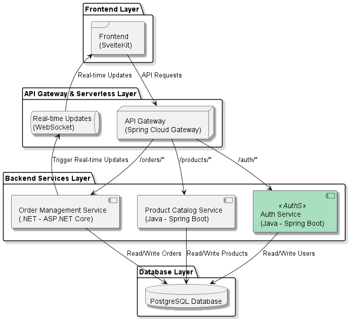
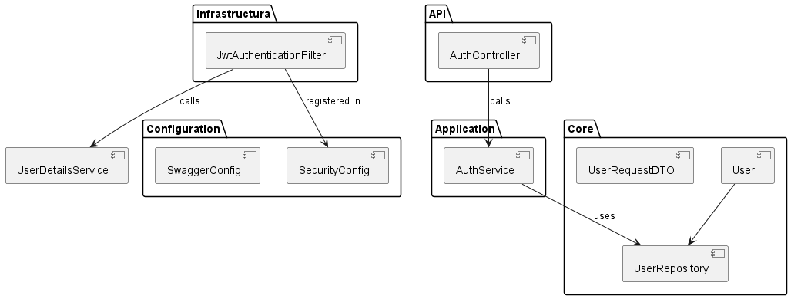
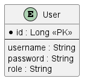

# AuthService
### Software Architecture Overview

The diagram below illustrates the layered architecture of the **Product Service** as part of an e-commerce platform. The architecture follows an **Onion Architecture** approach, ensuring the separation of concerns and promoting modularity and scalability. Each layer has a distinct role and interacts with the adjacent layers through well-defined interfaces.



## Project Description
AuthService is a Spring Boot application designed to handle authentication using JWT (JSON Web Tokens) for secure API access. It uses PostgreSQL as the database and integrates with Spring Security for managing authentication and authorization.

## Clean Architecture




The architecture is organized into multiple layers, each with a specific purpose:

1. **API Layer**: Manages HTTP requests and maps them to the corresponding services. It uses Spring controllers (`@RestController`) to handle CRUD operations and respond in JSON format.

2. **Application Layer**: Contains the business logic through services that interact with repositories and entities. This layer acts as an intermediary between the API layer and the infrastructure layer.

3. **Core Layer**: Defines the domain entities and repository interfaces, ensuring independence from the persistence infrastructure. It also contains custom exceptions to handle domain-specific errors.

4. **Infrastructure Layer**: Provides concrete implementations for the repositories using Spring Data JPA, managing the interaction with the PostgreSQL database configured in the application.

5. **Configuration Layer**: Includes application-specific configuration such as database setup and logging management using YAML files.

## Features

- User registration and authentication with JWT token issuance.
- JWT token validation and filtering for secured API access.
- Integration with PostgreSQL using Spring Data JPA.
- API documentation using SpringDoc OpenAPI (Swagger UI).
- CSRF protection and configuration.

## Requirements

- Java 17+
- PostgreSQL
- Maven

## Getting Started

### Clone the repository

```bash
git clone <repository-url>
```

### Build and run the application

```bash
cd AuthService
mvn clean install
mvn spring-boot:run
```

### Access the application

- Swagger UI: [http://localhost:8081/swagger-ui/index.html](http://localhost:8081/swagger-ui/index.html)
- The application runs on port **8081** by default (configured in `application.yml`).

## Configuration

### Database Configuration



The application connects to a PostgreSQL database. Make sure you have PostgreSQL installed and running with the following credentials, or adjust them in `src/main/resources/application.yml`:

```yaml
spring:
  datasource:
    url: jdbc:postgresql://localhost:5432/auth
    username: pruebapsqluser
    password: test
    driver-class-name: org.postgresql.Driver
```

### JWT Configuration

The JWT settings are configured in the `application.yml` file:

```yaml
jwt:
  secret: /eNjZ33uOWV5BeX0oEHTlU3gR5O8dCDgslDASXC2wME=
  expiration: 86400000
```

- **secret**: A base64-encoded key used to sign the JWT tokens.
- **expiration**: The validity duration of the token in milliseconds (default: 24 hours).

## Dependencies

The project uses the following dependencies (from `pom.xml`):

- Spring Boot Starter Web, Security, and Data JPA
- PostgreSQL JDBC driver
- jjwt for JWT token handling
- SpringDoc OpenAPI for API documentation
- Lombok for reducing boilerplate code

## Testing

The project includes tests for authentication using Spring Security Test. To run the tests:

```bash
mvn test
```

## Notes

- Ensure that the PostgreSQL service is running and accessible before starting the application.
- Update the JWT secret and other sensitive information in the configuration file for production use.

## License

MIT License
